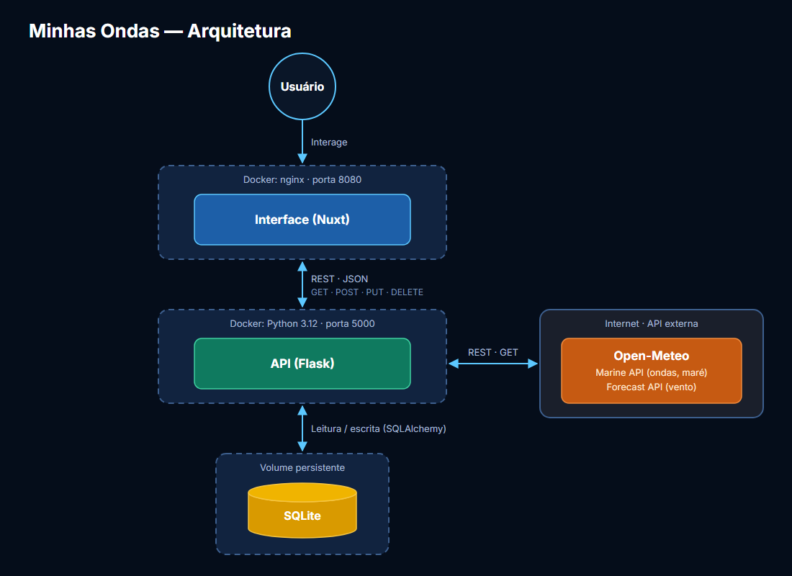

# Minhas Ondas — API

API REST do **Minhas Ondas**, um painel para monitorar as condições de surf dos seus
picos favoritos. A API guarda os picos cadastrados pelo usuário (posição e condições
preferidas), coleta ondas, maré e vento na **Open-Meteo**, calcula um **score de
qualidade (0 a 10)** para cada hora e indica o **melhor pico para ir** em cada momento.

Faz parte de um sistema com três módulos:

| Módulo | Repositório |
|--------|-------------|
| Interface (Nuxt) | [minhas-ondas-front](https://github.com/ericopuc/minhas-ondas-front) |
| API principal (este) | [minhas-ondas-api](https://github.com/ericopuc/minhas-ondas-api) |
| API externa | [Open-Meteo](https://open-meteo.com/) — Marine API e Forecast API |

## Arquitetura



- O usuário interage somente com a interface, que se comunica com esta API via REST/JSON.
- Esta API é o único módulo que acessa o **SQLite** e a **Open-Meteo**.
- Os dados coletados de cada pico ficam armazenados por **1 hora**; depois disso, a
  próxima consulta busca dados novos. Se a Open-Meteo falhar, os dados antigos são reaproveitados.

## Funcionalidades

- **CRUD de picos** com nome, latitude/longitude e condições preferidas (direção, tamanho
  e período da ondulação e direção do vento).
- **Validação do local:** ao criar ou mover um pico, a API consulta a Open-Meteo e **recusa
  pontos em terra ou longe do mar** (sem dados de ondas, elevação acima de 5 m ou célula de
  mar a mais de 12 km). Nada é salvo nesses casos.
- **Score por hora** do dia anterior aos próximos 7 dias, com as notas parciais de cada fator.
- **Ranking por momento**, sempre relativo aos horários de interesse (**6h, 10h, 14h e 18h**):
  - antes das 6h: os horários de hoje;
  - das 6h às 16h: o horário atual ("agora") e os próximos horários de interesse;
  - depois das 16h: os horários de amanhã, a partir das 6h;
  - em seguida, a manhã e a tarde do dia seguinte (6h e 14h) e a manhã do outro dia (6h).
    Ex.: domingo à noite → amanhã 6h, 10h, 14h e 18h; terça 6h e 14h; quarta 6h.

  A primeira opção é o padrão. Os horários ficam em `HORARIOS_INTERESSE` e
  `HORARIOS_EXTRAS` em [`momento.py`](momento.py).

## API externa

**Nome:** [Open-Meteo](https://open-meteo.com/) — [Marine API](https://open-meteo.com/en/docs/marine-weather-api) e [Forecast API](https://open-meteo.com/en/docs)

| Item | Informação |
|------|------------|
| Licença | Dados sob [CC BY 4.0](https://creativecommons.org/licenses/by/4.0/) — exige atribuição (exibida na interface) |
| Termos | Uso gratuito para fins **não comerciais** ([termos](https://open-meteo.com/en/terms)) |
| Cadastro | **Não é necessário** — sem chave de acesso |
| Limites | Menos de 10.000 chamadas por dia no plano gratuito; o cache de 1 hora reduz o consumo |

> A Marine API não fornece vento. Por isso o vento vem da Forecast API, da mesma
> Open-Meteo, com os mesmos termos.

**Rotas utilizadas:**

| Método | Rota | Parâmetros usados | Uso no projeto |
|--------|------|-------------------|----------------|
| `GET` | `https://marine-api.open-meteo.com/v1/marine` | `latitude`, `longitude`, `hourly=wave_height,wave_direction,wave_period,swell_wave_height,swell_wave_direction,swell_wave_period,sea_level_height_msl,sea_surface_temperature`, `timezone`, `past_days=1`, `forecast_days=7` | Ondas, ondulação (swell), maré e temperatura da água; valida se o ponto está no mar |
| `GET` | `https://api.open-meteo.com/v1/forecast` | `latitude`, `longitude`, `hourly=wind_speed_10m,wind_direction_10m,wind_gusts_10m`, `wind_speed_unit=kn`, `timezone`, `past_days=1`, `forecast_days=7` | Velocidade, rajada e direção do vento, em nós |

## Algoritmo do score

O score (0–10, com uma casa decimal) de cada hora combina quatro notas parciais (0–1) por **média geométrica
ponderada** — um único fator muito ruim (mar flat, vento maral forte) derruba o score:

| Fator | Peso | Como é calculado |
|-------|------|------------------|
| Tamanho | 0,35 | Proximidade da altura da ondulação com a preferida (abaixo do ideal penaliza mais) |
| Vento | 0,35 | Vento fraco é sempre bom; na direção preferida é o ideal, mas acima de 10 nós começa a atrapalhar; contrário é ruim e contrário forte é péssimo; vento entrando junto com a ondulação (maral) ou lateral é ruim, a menos que fraco |
| Período | 0,18 | Proximidade do período preferido (período maior é menos penalizado) |
| Direção | 0,12 | Desvio entre a direção da ondulação e a preferida |

Todos os pesos e limites ficam no dicionário **`CALIBRACAO`** no topo de
[`score.py`](score.py). Ajuste os valores e reinicie a API; como o score é calculado a
cada requisição, a mudança vale imediatamente, inclusive para os dados já armazenados.

## Tecnologias

- **Python 3.12**, **Flask** e **flask-openapi3** (documentação OpenAPI/Swagger)
- **SQLAlchemy** + **SQLite** (persistência)
- **Pydantic** (validação de dados)
- **Requests** (consumo da Open-Meteo)
- **Docker**

## Pré-requisitos

- [Python 3.12+](https://www.python.org/downloads/) e `pip`, **ou**
- [Docker](https://docs.docker.com/get-docker/)

## Instalação e execução local

> Recomenda-se o uso de um ambiente virtual ([virtualenv](https://virtualenv.pypa.io/en/latest/)).

**1. Clone o repositório e acesse a pasta do projeto:**

```bash
git clone https://github.com/ericopuc/minhas-ondas-api.git
cd minhas-ondas-api
```

**2. Crie e ative o ambiente virtual:**

- **Windows (PowerShell):**
  ```powershell
  python -m venv .venv
  .\.venv\Scripts\Activate.ps1
  ```
- **Linux / macOS:**
  ```bash
  python -m venv .venv
  source .venv/bin/activate
  ```

**3. Instale as dependências:**

```bash
pip install -r requirements.txt
```

**4. (Opcional) Ajuste as configurações:** copie `.env.example` para `.env` e altere os
valores desejados. Sem o `.env`, os valores padrão são usados.

**5. Inicie a API:**

```bash
flask run --host 0.0.0.0 --port 5000
```

Durante o desenvolvimento, use `--reload` para reiniciar a cada alteração no código.

Acesse [http://localhost:5000/](http://localhost:5000/): a rota raiz redireciona para a
documentação interativa (Swagger). O banco SQLite é criado em `database/db.sqlite3` na
primeira execução.

## Execução com Docker

```bash
# construir a imagem
docker build -t minhas-ondas-api .

# executar, publicando a porta e guardando o banco em um volume
docker run -d --name minhas-ondas-api -p 5000:5000 -v minhas-ondas-db:/app/database minhas-ondas-api

# (opcional) passar configurações
docker run -d --name minhas-ondas-api -p 5000:5000 -v minhas-ondas-db:/app/database --env-file .env minhas-ondas-api

# acompanhar os logs
docker logs -f minhas-ondas-api
```

## Rotas

| Método | Rota | Descrição |
|--------|------|-----------|
| `GET` | `/picos` | Lista os picos com a condição atual, a condição no momento padrão e a tendência do score (próximas 12 h e variação até o próximo horário de interesse) |
| `GET` | `/pico?id=` | Detalhe do pico: todas as horas coletadas com score e notas parciais |
| `POST` | `/pico` | Adiciona um pico (valida se o local está no mar) |
| `PUT` | `/pico?id=` | Atualiza um pico; ao mudar a posição, valida e coleta os dados de novo |
| `DELETE` | `/pico?id=` | Remove um pico e os dados armazenados dele |
| `GET` | `/ranking?momento=` | Ranking dos picos pelo score no momento (`agora` ou uma hora, ex.: `2026-09-28T06:00`); devolve também as opções do seletor |

Erros seguem o formato `{"mensagem": "..."}`: `400` (local fora do mar ou dados
inválidos), `404` (pico não encontrado), `409` (nome repetido), `422` (validação de
entrada), `502`/`504` (falha ou demora da Open-Meteo).

## Configuração

| Variável | Padrão | Descrição |
|----------|--------|-----------|
| `CACHE_MINUTOS` | `60` | Tempo que os dados coletados ficam armazenados |
| `FUSO_HORARIO` | `America/Sao_Paulo` | Fuso das consultas e dos momentos do ranking |
| `DIAS_PASSADOS` / `DIAS_PREVISAO` | `1` / `7` | Histórico e previsão solicitados à Open-Meteo |
| `ELEVACAO_MAXIMA_MAR_M` | `5` | Elevação máxima do ponto para ser considerado mar |
| `DISTANCIA_MAXIMA_MAR_KM` | `12` | Distância máxima até a célula de mar usada pela Open-Meteo |
| `API_EXTERNA_TIMEOUT` | `10` | Tempo máximo de espera pela Open-Meteo (s) |

## Estrutura

```
minhas-ondas-api/
├── app.py            # Rotas, cache e ranking
├── config.py         # Configurações lidas de variáveis de ambiente
├── score.py          # Algoritmo do score e CALIBRACAO
├── momento.py        # Horários de interesse e opções do ranking
├── logger.py         # Logging centralizado
├── model/            # Pico e Previsao (SQLAlchemy)
├── schemas/          # Contratos da API (Pydantic)
├── services/         # Cliente da Open-Meteo
├── docs/             # Fluxograma da arquitetura
├── Dockerfile
└── requirements.txt
```
